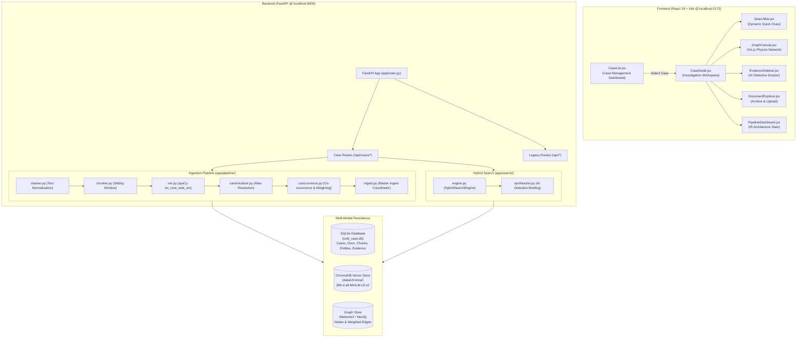
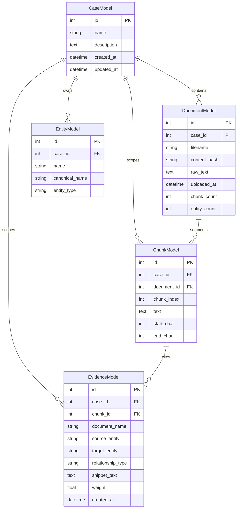
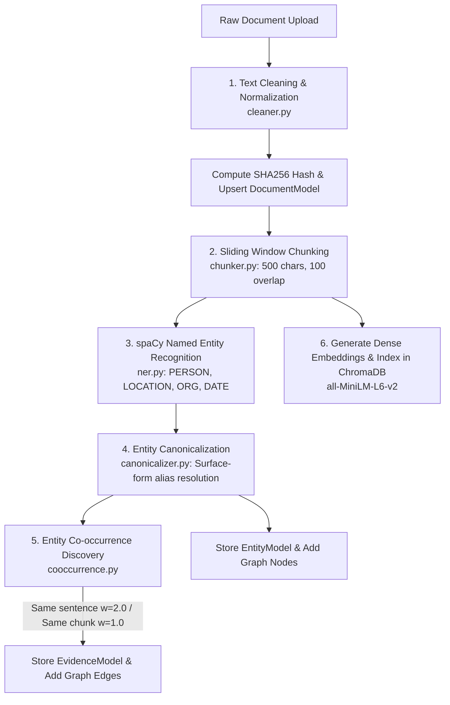
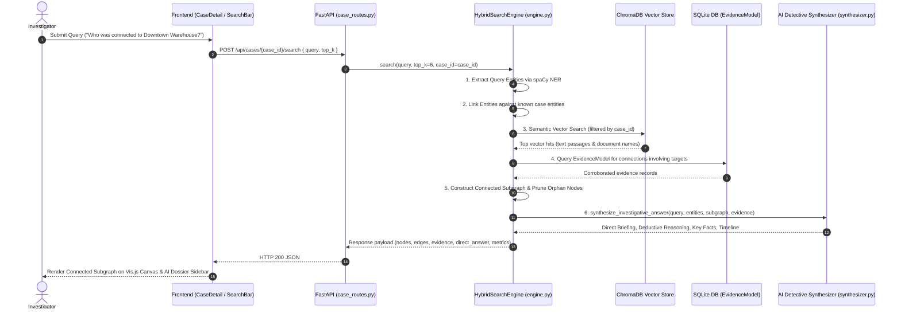

# Architecture Specification: `cold_case`

This document provides a comprehensive technical breakdown of the architecture, subsystems, data models, processing pipelines, and data flows implemented in `cold_case`.

---

## 1. System Overview

`cold_case` is built with a decoupled client-server architecture:
- **Client**: A React 19 single-page application built with Vite, utilizing Vis-network for force-directed graph rendering.
- **Server**: A FastAPI backend providing asynchronous REST endpoints, an NLP ingestion pipeline, a hybrid search engine, and an AI Detective briefing synthesizer.
- **Storage Layer**: A multi-modal persistence architecture comprising SQLite (relational records), ChromaDB (semantic vector embeddings), and NetworkX/Neo4j (graph relationships).



---

## 2. Frontend Subsystems

### 2.1 Technology & Configuration
- **Framework**: React 19.2.8 with JSX, functional components, and standard React hooks (`useState`, `useEffect`, `useRef`).
- **Bundler**: Vite 8.2.2 configured in `frontend/vite.config.js`.
- **Graph Visualization**: `vis-network` (10.1.2) with `vis-data` DataSet containers.
- **Iconography**: `lucide-react` (1.39.0).
- **Styling**: Vanilla CSS utilizing CSS variables defined in `frontend/src/index.css` (Detective Noir color palette: `#0a0d14` background, `#f59e0b` amber accents, `#fbbf24` gold headers).

### 2.2 Application State & Routing
The frontend employs lightweight state-driven navigation managed in `frontend/src/App.jsx`:
- `currentPage = 'cases'`: Renders `<CaseList />`.
- `currentPage = 'detail'`: Renders `<CaseDetail caseData={selectedCase} onBack={...} />`.

### 2.3 Key Components

#### 1. `CaseList.jsx`
- **Location**: `frontend/src/pages/CaseList.jsx`
- **Purpose**: Displays the investigation case directory, case statistics (active cases, documents, entities, relationships), case filtering, case deletion, demo dataset loading, and a creation modal for new investigation dossiers.

#### 2. `CaseDetail.jsx`
- **Location**: `frontend/src/pages/CaseDetail.jsx`
- **Purpose**: Container for an active case investigation. Maintains tabs for:
  - `investigation`: Search bar, graph canvas, and evidence sidebar.
  - `documents`: Document explorer with file transcript reader and upload zone.
  - `pipeline`: 6-stage IR pipeline metrics and system reset.
- **State**: Holds `graphData`, `documents`, `currentQuery`, `searchEvidence`, `searchMetrics`, `directAnswer`, `selectedEdge`, `selectedNode`, `sidebarVisible`.

#### 3. `SearchBar.jsx`
- **Location**: `frontend/src/components/SearchBar.jsx`
- **Purpose**: Query input with search execution, output reset ("Full Case View"), sidebar toggle, and dynamic **Quick Clues** derived from active case entities and relationships (`GET /api/cases/{case_id}/quick-clues`).

#### 4. `GraphCanvas.jsx`
- **Location**: `frontend/src/components/GraphCanvas.jsx`
- **Purpose**: Renders the interactive Vis.js 2D force-directed network graph:
  - Nodes color-coded by entity type (Person: Blue `#1e3a8a`, Location: Amber `#78350f`, Organization: Emerald `#064e3b`, Date: Rose `#881337`, Unknown: Slate `#334155`).
  - Edges weighted by co-occurrence strength ($w=1.0$ to $w \ge 2.0$), labeled with multiplier tags ($\times2$, $\times4$).
  - Physics controls: Fit Viewport, Zoom In/Out, Freeze/Unfreeze Physics simulation.
  - Click handlers triggering relationship inspection (`onSelectEdge`) or entity focus (`onSelectNode`).

#### 5. `EvidenceSidebar.jsx`
- **Location**: `frontend/src/components/EvidenceSidebar.jsx`
- **Purpose**: AI Detective Agent intelligence panel:
  - **AI Briefing Tab**: Lead Investigator Assessment, Deductive Reasoning breakdown, Key Corroborated Facts (`[Source: ...]`), Suspects & Persons of Interest profile, and Verified Confidence Score.
  - **Source Citations Tab**: Verbatim evidence passages ranked by relevance score with direct links to source documents.
  - **Timeline Tab**: Reconstructed chronological date/time anchors extracted from evidence.
  - **Relationship Interrogation**: Triggered on edge selection to reveal sentence-level proof between two specific entities.

#### 6. `DocumentExplorer.jsx`
- **Location**: `frontend/src/components/DocumentExplorer.jsx`
- **Purpose**: Case file archive browser:
  - File list with chunk count and entity count metrics.
  - Drag-and-drop / file input button for uploading `.txt` case files.
  - Verbatim transcript reader with syntax highlighting.
  - Extracted named entities tag cloud.
  - Document deletion action triggering database and graph re-synchronization.

#### 7. `PipelineDashboard.jsx`
- **Location**: `frontend/src/components/PipelineDashboard.jsx`
- **Purpose**: Architectural monitoring dashboard showing live metrics (Documents, Entity Nodes, Relationships, Vector Chunks), file upload zone, active document manager, and the 6-stage NLP pipeline cards.

---

## 3. Backend Subsystems

### 3.1 Framework & Entry Point
- **Framework**: FastAPI (0.110.0) running under Uvicorn.
- **Entry Point**: `backend/app/main.py`.
- **Application Lifespan**: Initializes relational database tables (`init_db()`) on startup.
- **CORS Configuration**: Wildcard origins enabled (`*`) for cross-origin local React requests.
- **Route Prefixes**: Mounted at `/api` (`settings.API_V1_STR`).

### 3.2 Configuration (`backend/app/config.py`)
Managed via Pydantic `BaseSettings`:
- `DATABASE_URL`: Defaults to `sqlite:///<workspace_root>/cold_case.db`.
- `NEO4J_URI`, `NEO4J_USER`, `NEO4J_PASSWORD`: Neo4j graph configuration (optional).
- `CHROMA_PERSIST_DIR`: Defaults to `<workspace_root>/data/chroma`.
- `EMBEDDING_MODEL`: `"all-MiniLM-L6-v2"` (384-dimensional dense vectors).
- `CHUNK_SIZE`: `500` characters.
- `CHUNK_OVERLAP`: `100` characters.
- `SPACY_MODEL`: `"en_core_web_sm"`.

---

## 4. Data Storage Architecture



### 4.1 Storage Layers

1. **Relational Database (`cold_case.db` via SQLAlchemy)**:
   - Preserves complete document transcripts, chunk index metadata, unique case-scoped entities, and verifiable evidence relationships.
   - Enforces unique constraints: `(case_id, filename)` on `documents`, and `(case_id, canonical_name)` on `entities`.
   - Cascades deletions on `case_id` or `document_id`.

2. **Graph Storage (`backend/app/graph/`)**:
   - **`NetworkXGraphStore` (`networkx_store.py`)**: In-memory graph engine (`nx.Graph`). Stores entity nodes (with `type`, `label`, `degree`) and undirected edges (with `weight`, `evidence` list, and `documents` set).
   - **`Neo4jGraphStore` (`neo4j_store.py`)**: Optional Neo4j graph store utilizing parameterized Cypher queries (`MERGE (n:Entity ...)`, `MERGE (a)-[r:CO_OCCURRED_IN]->(b)`).

3. **Vector Database (`backend/app/vector/chroma_store.py`)**:
   - `ChromaVectorStore` utilizing `chromadb.PersistentClient` stored at `data/chroma`.
   - Embeddings generated via `sentence_transformers.SentenceTransformer("all-MiniLM-L6-v2")`.
   - Stores chunk text with metadata: `{"chunk_id": int, "case_id": int, "document_name": str, "start_char": int, "end_char": int}`.

---

## 5. Document Ingestion Pipeline

When a document is uploaded via `POST /api/cases/{case_id}/documents`, it executes `ingest_document()` in `backend/app/pipeline/ingest.py`:



### Stage Details:
1. **Cleaning (`cleaner.py`)**: Removes control characters, normalizes Unicode smart quotes/dashes, standardizes line breaks, and collapses extraneous whitespace.
2. **Chunking (`chunker.py`)**: Splits text into 500-character segments with 100-character overlap, attempting to preserve sentence boundaries where possible.
3. **NER (`ner.py`)**: Uses `spaCy` (`en_core_web_sm`) to extract named entities and classifies them into `PERSON`, `LOCATION`, `ORGANIZATION`, and `DATE`.
4. **Canonicalization (`canonicalizer.py`)**: Normalizes titles (e.g. *"Dr. Bakshi"* $\to$ *"Dr. H. S. Bakshi"*, *"Sarah"* $\to$ *"Sarah Rao"*) to ensure consistent node IDs.
5. **Co-Occurrence (`cooccurrence.py`)**: Evaluates pairwise entity combinations within each chunk. If both entities appear in the exact same sentence, assigns weight $w=2.0$; otherwise $w=1.0$. Extracts verbatim sentence snippets as verifiable proof.
6. **Vector Indexing (`chroma_store.py`)**: Computes 384-dimensional dense embeddings for each chunk and writes to the persistent ChromaDB collection with `case_id` metadata.

---

## 6. Search Architecture & AI Detective Synthesis

When an investigator submits a query via `POST /api/cases/{case_id}/search`:



### Subgraph Pruning Logic:
To ensure the graph answers the user's inquiry cleanly without displaying unrelated disconnected nodes:
1. Target entities are identified from query NER, linked case node names, and top semantic vector hits.
2. Relationships involving target entities are retrieved from `EvidenceModel`.
3. Only nodes that have **at least one connecting edge** in the target relationship set (or are an explicit query target) are retained in `nodes`.
4. Edges are filtered to ensure both `source` and `target` exist in the retained nodes list.
5. If the query is empty or cleared, the engine returns the **full whole-case graph**.

---

## 7. API Architecture Specification

### Case Management Endpoints (`/api/cases`)

#### 1. Create Case
- **Method**: `POST`
- **Path**: `/api/cases`
- **Purpose**: Creates a new investigation case dossier.
- **Request Body**: `{"name": "string", "description": "string (optional)"}`
- **Response**: `CaseResponse` JSON (`id`, `name`, `description`, `created_at`, `updated_at`, `document_count`, `entity_count`, `relationship_count`)
- **Errors**: `400` validation error.

#### 2. List Cases
- **Method**: `GET`
- **Path**: `/api/cases`
- **Purpose**: Lists all investigation cases with real-time aggregate document and entity counts.
- **Response**: `List[CaseResponse]`

#### 3. Get Case
- **Method**: `GET`
- **Path**: `/api/cases/{case_id}`
- **Purpose**: Retrieves a specific case metadata by ID.
- **Errors**: `404` Case not found.

#### 4. Update Case
- **Method**: `PUT`
- **Path**: `/api/cases/{case_id}`
- **Request Body**: `{"name": "string (optional)", "description": "string (optional)"}`
- **Response**: Updated `CaseResponse`

#### 5. Delete Case
- **Method**: `DELETE`
- **Path**: `/api/cases/{case_id}`
- **Purpose**: Permanently deletes a case and cascades deletion to all associated documents, chunks, entities, and evidence.
- **Response**: `{"message": "Case {case_id} deleted successfully"}`

#### 6. Upload Case Documents
- **Method**: `POST`
- **Path**: `/api/cases/{case_id}/documents`
- **Purpose**: Ingests one or multiple text files (`.txt`) into a case with universal encoding detection.
- **Form Data**: `file` (UploadFile, optional) or `files` (List[UploadFile], optional).
- **Response**: `{"message": str, "documents": List[DocumentResponse], "errors": List[str]}`
- **Errors**: `400` Empty upload, `404` Case not found, `500` Ingestion failure.

#### 7. List Case Documents
- **Method**: `GET`
- **Path**: `/api/cases/{case_id}/documents`
- **Purpose**: Lists all documents uploaded to a case.
- **Response**: `List[DocumentResponse]` (`id`, `filename`, `uploaded_at`, `chunk_count`, `entity_count`)

#### 8. Delete Case Document
- **Method**: `DELETE`
- **Path**: `/api/cases/{case_id}/documents/{doc_id}`
- **Purpose**: Removes a document, deletes its chunks from ChromaDB, and cleans up evidence.
- **Response**: `{"message": "Document {doc_id} removed from case {case_id}"}`

#### 9. Case Hybrid Search
- **Method**: `POST`
- **Path**: `/api/cases/{case_id}/search`
- **Purpose**: Executes hybrid vector + connected subgraph search scoped to a case.
- **Request Body**: `{"query": "string", "top_k": 6}`
- **Response**:
  ```json
  {
    "query": "string",
    "query_entities": ["string"],
    "direct_answer": {
      "summary": "string",
      "detective_briefing": "string",
      "deductive_reasoning": "string",
      "key_findings": ["string"],
      "persons_of_interest": ["string"],
      "locations_identified": ["string"],
      "organizations_involved": ["string"],
      "timeline_anchors": [{"time_anchor": "string", "event": "string", "source": "string"}],
      "confidence_score": "string",
      "corroborated_sources": 4,
      "source_documents": ["string"]
    },
    "nodes": [{"id": "string", "label": "string", "type": "string"}],
    "edges": [{"source": "string", "target": "string", "weight": 2.0, "relationship": "string", "document": "string"}],
    "evidence": [{"document": "string", "text": "string", "score": 0.9, "type": "string"}],
    "metrics": {"execution_time_ms": 45.2, "total_nodes": 6, "total_edges": 4, "total_evidence": 3}
  }
  ```

#### 10. Get Case Graph
- **Method**: `GET`
- **Path**: `/api/cases/{case_id}/graph`
- **Purpose**: Returns the complete knowledge graph (all nodes and edges) for a case.
- **Response**: `{"case_id": int, "case_name": str, "nodes": list, "edges": list, "total_nodes": int, "total_edges": int}`

#### 11. Get Relationship Evidence
- **Method**: `GET`
- **Path**: `/api/cases/{case_id}/evidence/{source}/{target}`
- **Purpose**: Returns verbatim evidence snippets linking two entities in a case.
- **Response**: `{"case_id": int, "source": str, "target": str, "evidence_count": int, "evidence": list}`

#### 12. Get Case Quick Clues
- **Method**: `GET`
- **Path**: `/api/cases/{case_id}/quick-clues`
- **Purpose**: Returns dynamic investigative questions tailored to the active case's entities and evidence.
- **Response**: `List[str]` (e.g. `["What connects Sarah Rao and John Mehta?", "Who was connected to Downtown Warehouse in 1995?"]`)

---

## 8. Frontend ↔ Backend Data Flow Summary

| Action | Frontend Trigger | Backend Endpoint | Persistence Accessed | Resulting UI State |
|---|---|---|---|---|
| **View Cases** | Open app (`App.jsx`) | `GET /api/cases` | SQLite (`CaseModel`) | Displays case cards & global stats |
| **Open Case** | Click case card | `GET /api/cases/{id}/graph`<br>`GET /api/cases/{id}/documents` | SQLite (`EntityModel`, `EvidenceModel`, `DocumentModel`) | Opens `CaseDetail`, renders full case graph |
| **Ask Question** | Type in search bar or click Quick Clue pill | `POST /api/cases/{id}/search` | ChromaDB + SQLite + NetworkX | Canvas renders connected subgraph; EvidenceSidebar renders AI Detective Briefing |
| **Clear Search** | Click "Full Case View" | `GET /api/cases/{id}/graph` | SQLite (`EntityModel`, `EvidenceModel`) | Canvas resets to whole case graph |
| **Click Edge** | Click line on graph canvas | `GET /api/cases/{id}/evidence/{src}/{tgt}` | SQLite (`EvidenceModel`) | EvidenceSidebar switches to Relationship Interrogation |
| **Upload Document** | Drag/drop or choose file in Archive | `POST /api/cases/{id}/documents` | Pipeline $\to$ SQLite + ChromaDB + GraphStore | Case document list, graph, and vector index updated |
| **Delete Document** | Click trash icon on document card | `DELETE /api/cases/{id}/documents/{docId}` | SQLite + ChromaDB delete | Document removed, graph re-synchronized |
